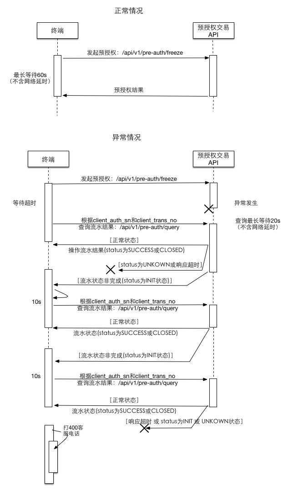

# 接口列表

预授权平台提供如下接口功能：

* [**激活接口**](/api/interface/activate.md)：激活接口用于通过激活码来获取终端\(terminal_sn\)和终端密钥\(terminal\\_key_\)，用于其他接口签名；
* [**签到接口**](/api/interface/checkin.md)：签到接口用于更新终端密钥\(terminal\\_key\)，接入方自行决定何时调用签到接口，一旦更新就密钥失效；
* [**预授权接口**](/api/interface/freeze.md)：使用扫码枪等条码识别设备扫码条码，完成用户资金授权接口；
* [**预授权撤销接口**](/api/interface/unfreeze.md)：因业务需要撤销用户授权资金，可进行资金撤销，支持部分撤销；
* [**预授权操作查询接口**](/api/interface/query.md)：使用该接口根据操作流水号查询预授权订单当前操作信息与状态；
* [**预授权完成接口**](/api/interface/pay.md)：授权资金进行支付给卖家，支持支付后撤销剩余授权资金；
* [**预授权完成退款接口**](/api/interface/refund.md)：通过商户交易订单号或收钱吧系统交易订单号退款；
* [**预授权流水操作记录查询接口**](/api/interface/query_trans.md)：通过商户预授权订单号或收钱吧预授权订单号查询操作流水记录；


### 预授权主要功能交互时序

#### 预授权

预授权接口何时发起轮询：预授权接口设置超时为60s，若请求接口超时，就需要马上发起轮询。
轮询时间可以在3~10s，总时长控制在80s以内。

```
预授权接口返回：biz_response.result_code是指一个动作的状态。biz_response.data罗列预授权当前操作信息信息，biz_response.data.status是指本次流水操作状态。
```




#### 预授权撤销


#### 预授权完成

#### 预授权完成退款


