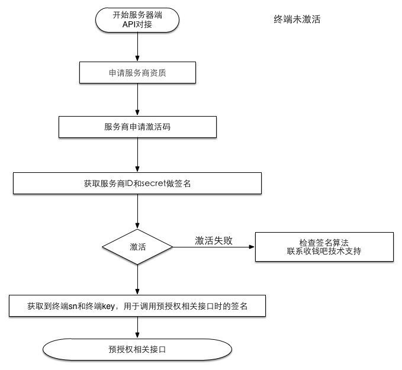

# 接入流程

## 对接过程的业务流程

正常使用收钱吧平台的预授权功能，至少需要经历如下三个步骤：

1. 激活\(一次\)
2. 签到\(可选\)
3. 预授权

## 激活

激活接口用于通过终端激活码（code）来获取终端号（terminal\_sn）和终端密钥（terminal\_key），以用于调用其他接口时的签名。

激活接口对于同一台终端，只需要调用一次。

## 

## 签到

签到接口用于更新终端密钥（terminal\_key）。出于安全考虑，开发者可以自行决定何时调用签到接口。终端密钥（terminal\_key）一旦更新，旧密钥将会失效。

注：签到后secret丢失怎么办？

若因网络或其他原因未收到签到响应，可使用旧密钥再次发起签到请求。

极特殊情况下，两次签到均未收到响应，请联系客服处理。

